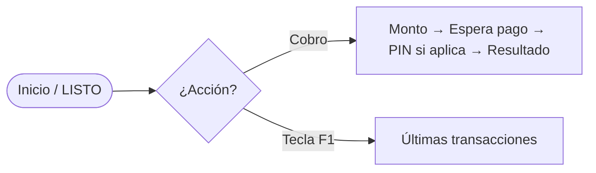
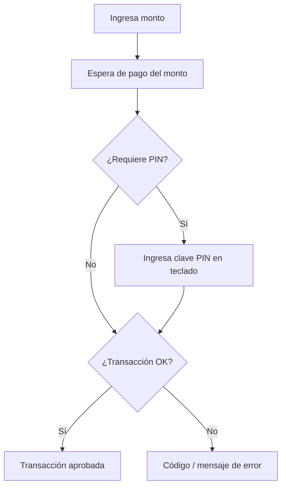
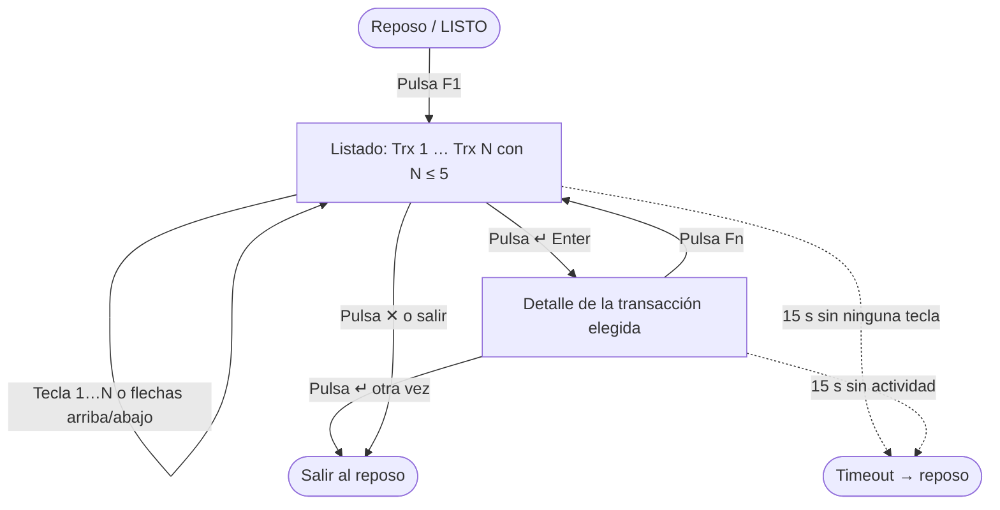
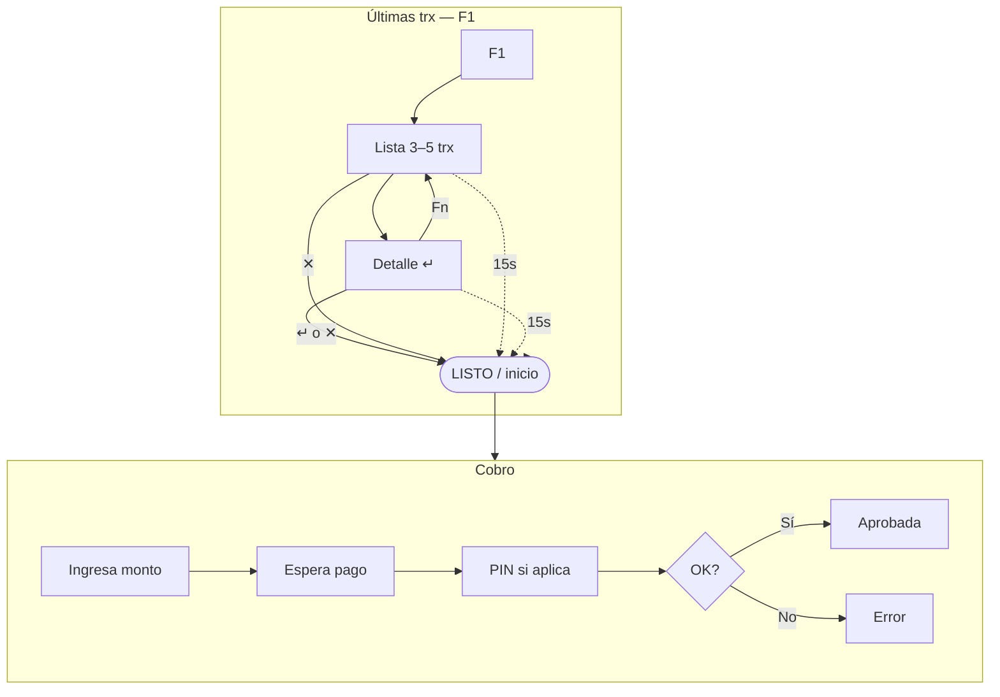

# Flujo — LCD y teclado físico (vendedor)

Documento de **idea de producto** para la cara del POS con **pantalla LCD pequeña** y **teclado físico** (no la pantalla táctil del cliente). Complementa el flujo principal descrito en `flujo-pos.md`.

---

## Resumen en una frase

El vendedor **cobra** con monto + espera de pago + PIN cuando aplica, **o** consulta las **últimas 3–5 transacciones** con **F1**, navega con teclas, ve el detalle con **↵**, vuelve al listado con **Fn** y sale o por **✕** o por **15 s sin tocar nada**.

---

## Vista general (dos caminos desde el inicio)

---

## Camino 1 — Cobro (happy path y resultado)

Alineado al POS frontal; aquí el LCD del vendedor solo **refleja estado** (monto, esperando, procesando, aprobado, error).

---

## Camino 2 — Últimas transacciones (F1)

Este bloque es **independiente** del cobro en curso: se entra con **F1** desde reposo (equipo listo para nueva venta). En el LCD caben **pocas líneas**; la lista muestra **entre 3 y 5** movimientos recientes (configurable en producto).

### Reglas rápidas (tabla)

| Elemento        | Rol |
|-----------------|-----|
| **F1**          | Abre “últimas transacciones”. |
| **Listado**     | Hasta **3–5** ítems; navegación sin menús largos en LCD. |
| **↵ (verde)**   | En lista: **ver detalle**. En detalle: **cerrar** y volver al día a día. |
| **Fn**          | Desde detalle: **volver al listado** (no sale del modo historial). |
| **✕**           | **Cancelar** el modo historial y volver al LCD normal. |
| **15 s INACT**  | Si no hay pulsaciones, **vuelve solo** al reposo (evita dejar el menú colgado). |

---

## Por qué está acotado así

- El **LCD es ancho y bajo**: solo caben **1–2 líneas útiles** por vista; no es una segunda app táctil.
- Las **teclas físicas** (números, ✱/flechas, Enter, Fn, X) son el **único** control fiable con dedos y sin mirar mucho.
- **3–5 transacciones** equilibra utilidad (“último movimiento del turno”) vs. tiempo de navegación.

---

## Relación con el simulador

En `izipay-sim.html`, el panel **“Pantalla Vendedor (Trasera)”** prototipa este flujo: constante `MERCHANT_HISTORY_MAX` (hasta 5), **F1 / Fn / ↓ / ✱ / ↵**, timeout **15 s** y registro al **aprobar** un cobro.

---

## Diagrama compacto (todo en uno)

