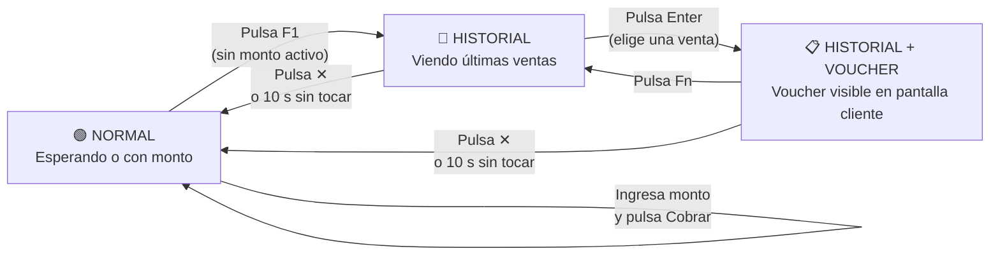
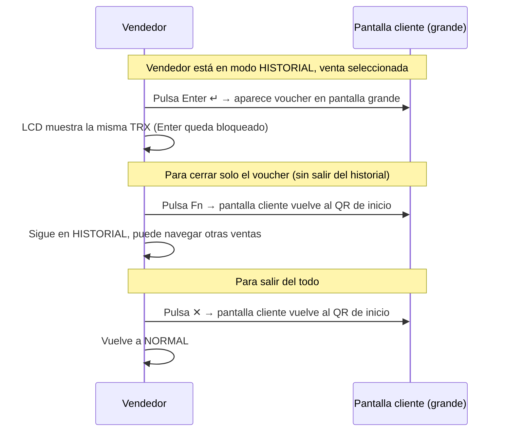
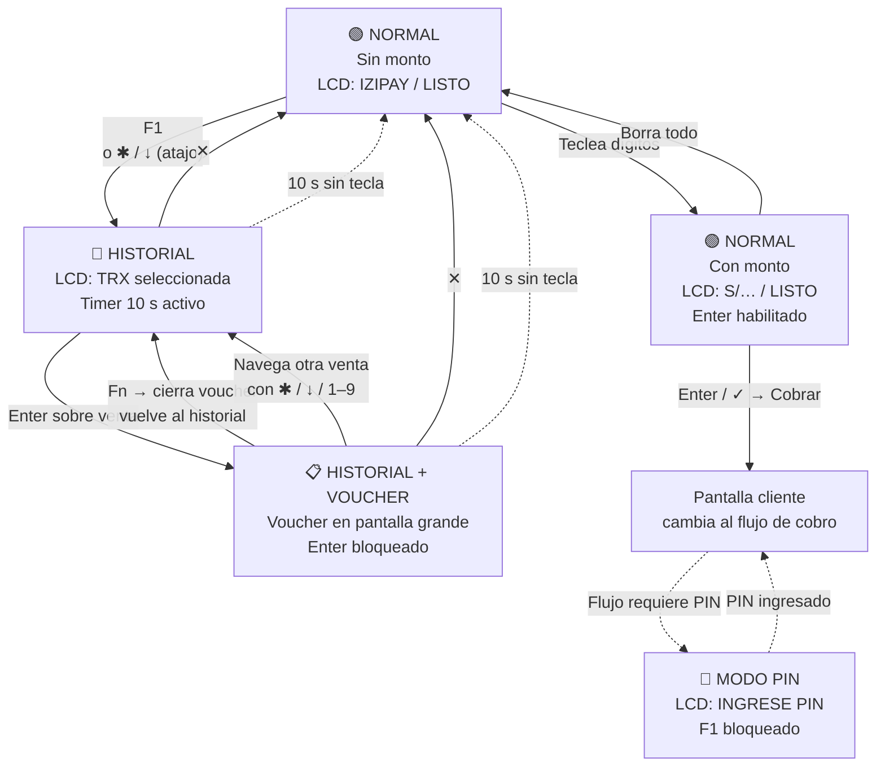

# Panel vendedor (cara trasera del POS) — Guía de flujo para Figma

Referencia visual para diagramar el comportamiento de la **cara trasera del POS** en FigJam o Figma. Sin jerga de código: solo estados, eventos y reglas de UX.

---

## 1. ¿Qué es este panel?

La cara trasera tiene **tres zonas interactivas**:

| Zona | Qué muestra |
|------|-------------|
| **LCD** (2 líneas, verde) | Mensajes de estado, historial de cobros, PIN, errores |
| **Display de monto** | El importe a cobrar (ej. `S/ 150.00`) |
| **Teclado físico** | Teclas numéricas + teclas de función |

> El LCD y la pantalla grande del cliente son independientes. El LCD siempre refleja el estado del **vendedor**; la pantalla grande es lo que **el cliente ve**.

---

## 2. Los 3 estados del panel



**Resumen:**
- **NORMAL** — el vendedor ingresa montos y cobra
- **HISTORIAL** — el vendedor navega sus últimas ventas (hasta 5)
- **HISTORIAL + VOUCHER** — se muestra el comprobante de una venta en la pantalla grande del cliente

---

## 3. Estado NORMAL — ingreso de monto

### LCD según situación

| Situación | Línea 1 del LCD | Línea 2 del LCD | Color |
|-----------|-----------------|-----------------|-------|
| Sin monto ingresado | `IZIPAY` | `LISTO` | Verde |
| Monto ingresado | `S/ 150.00` | `LISTO` | Verde |
| Esperando pago | `S/ 150.00` | `ESPERANDO...` | Verde |
| Procesando | `PROCESANDO...` | (vacío o estado) | Verde |
| PIN requerido | `INGRESE PIN` | `_ _ _ _` | Verde |
| Aprobado | `APROBADO` | `S/ 150.00` | Verde |
| Error | Tipo de error | Instrucción | Rojo/Naranja |

> **Límite del LCD:** máximo **16 caracteres por línea**. Los textos más largos se recortan.

### Teclas en modo NORMAL

| Tecla | Qué hace |
|-------|----------|
| **0–9** | Agrega dígito al monto |
| **← (borrar)** | Borra último dígito |
| **✱ (limpiar)** | Borra el monto completo |
| **↓** | No hace nada con monto ingresado |
| **✓ / Enter** | **Cobra** (solo si hay monto > 0) |
| **✕** | Cancela y vuelve a pantalla inicial |
| **F1** | Abre el historial de ventas |

---

## 4. Estado HISTORIAL — últimas ventas (F1)

### Cómo entrar

El vendedor pulsa **F1** desde el estado NORMAL cuando **no hay un cobro en curso**.

También puede deslizar el historial con **✱** o **↓** si el monto está en cero (atajo rápido).

### Lo que muestra el LCD

```
Línea 1:  TRX 2/5   10:40
Línea 2:  S/ 35.00 APROB
```

Si no hay ventas registradas:
```
Línea 1:  ULTIMAS TRX
Línea 2:  SIN MOVIMIENTO
```

### Teclas en modo HISTORIAL

| Tecla | Qué hace |
|-------|----------|
| **1 – 9** | Salta directo a esa venta (si existe) |
| **✱** | Va a la venta anterior (circular) |
| **↓** | Va a la venta siguiente (circular) |
| **Enter ↵** | Muestra el voucher de esa venta en la pantalla grande del cliente |
| **Fn** | (Sin efecto aquí — solo actúa cuando hay voucher abierto) |
| **✕** | Sale del historial y vuelve al estado NORMAL |

---

## 5. Estado HISTORIAL + VOUCHER

Cuando el vendedor pulsa **Enter** sobre una venta, el comprobante aparece en la pantalla grande del cliente.



### Regla de Enter según contexto

| Contexto | Qué hace Enter |
|----------|---------------|
| NORMAL, sin monto | No hace nada (bloqueado) |
| NORMAL, con monto | **Cobra** |
| HISTORIAL, sin ventas | No hace nada (bloqueado) |
| HISTORIAL, venta seleccionada | **Abre voucher** en pantalla cliente |
| HISTORIAL + VOUCHER ya abierto | No hace nada (bloqueado) |

---

## 6. Temporizador de inactividad — 10 segundos

> **Regla clave para UX:** si el vendedor está en modo HISTORIAL y **no toca ninguna tecla durante 10 segundos**, el panel **vuelve solo al estado NORMAL**.

Esto evita que el menú de historial quede abierto indefinidamente.

**El temporizador se reinicia cada vez que el vendedor:**
- Navega entre ventas
- Abre o cierra un voucher

**Si expira:**
- Se cierra el historial
- Si había un voucher en la pantalla grande, también se cierra
- El LCD vuelve a mostrar el monto o `IZIPAY / LISTO`

---

## 7. Diagrama completo de flujo



---

## 8. Tabla de teclas función (fila superior)

| Tecla | Cuándo actúa | Qué hace |
|-------|-------------|----------|
| **F1** | NORMAL, sin cobro en curso | Abre historial de ventas |
| **Fn** | HISTORIAL + VOUCHER abierto | Cierra solo el voucher, permanece en historial |
| **✕** | Siempre | Sale del historial si está activo; si no, cancela y resetea |
| **⏻ Power** | Siempre | Igual que ✕ en este flujo |

---

## 9. Sugerencias para armar en FigJam / Figma

1. **Tres swimlanes:**
   - `Vendedor (LCD + teclado)`
   - `Pantalla cliente (grande)`
   - `Timer de inactividad`

2. **Tres nodos de estado principales** (cajas grandes de color):
   - 🟢 `NORMAL`
   - 🔵 `HISTORIAL`
   - 📋 `HISTORIAL + VOUCHER`

3. **Color por estado LCD:**
   - Verde → todo bien
   - Naranja → sin movimiento / alerta
   - Rojo → error

4. **Decisión más importante:** "¿Hay voucher abierto?" — bifurca el comportamiento de Enter y Fn.

5. **Anota en el componente LCD:** "máx. 16 caracteres por línea" como spec de texto.

6. **El timer de 10 s** puede modelarse como un conector punteado desde HISTORIAL → NORMAL con la etiqueta "10 s sin actividad".
