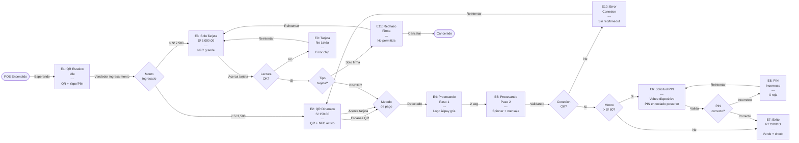

# Flujo POS Izipay Q161 Pro — Lógica y Casos

## Pantallas

| # | Pantalla | Descripción | Color |
|---|----------|-------------|-------|
| E1 | QR Estático (Idle) | POS encendido esperando venta. QR estático para Yape, Plin o Tarjeta | Teal #008380 |
| E2 | QR Dinámico (< S/ 2,500) | Monto S/ 150.00 + QR dinámico + NFC glow | Teal #008380 |
| E3 | Solo Tarjeta (> S/ 2,500) | Sin QR. Solo NFC/Chip. Animación grande | Negro #1A1A1A |
| E4 | Procesando Paso 1 | Logo Izipay gris. Pantalla limpia | Gris #555 |
| E5 | Procesando Paso 2 | Spinner teal + mensaje de validación | Gris #555 |
| E6 | Solicitud de PIN | Monto > S/ 80. Instrucción "Voltee el dispositivo" + PIN en teclado posterior | Rojo #dc1c1b |
| E7 | Éxito (RECIBIDO) | Verde full. Check + monto + "RECIBIDO" | Verde #28a745 |
| E8 | PIN Incorrecto | X roja + mensaje. ✓ Reintentar / ✕ Cancelar (teclado posterior) | Error #D32F2F |
| E9 | Tarjeta No Leída | Error de chip. ✓ Reintentar / ✕ Cancelar (teclado posterior) | Naranja #E65100 |
| E10 | Error de Conexión | Falla de red. ✓ Reintentar / ✕ Cancelar (teclado posterior) | Naranja #E65100 |
| E11 | Rechazo por Firma | Terminal no acepta firmas. ✓ Reintentar / ✕ Cancelar (teclado posterior) | Error #D32F2F |

---

## Flujo Principal (Happy Path)

```
POS Encendido
  └─> E1: QR Estático (Idle)
        └─> Vendedor ingresa monto
              ├─ Monto < S/ 2,500 ──> E2: QR Dinámico
              └─ Monto > S/ 2,500 ──> E3: Solo Tarjeta
```

## Desde E2: QR Dinámico (< S/ 2,500)

```
E2: QR Dinámico
  ├─ Cliente escanea QR (Yape/Plin) ──> E4: Procesando Paso 1
  └─ Cliente acerca tarjeta NFC ──────> E4: Procesando Paso 1
```

## Desde E3: Solo Tarjeta (> S/ 2,500)

```
E3: Solo Tarjeta
  └─ Cliente acerca/inserta tarjeta
        ├─ Lectura OK
        │     ├─ Tarjeta con PIN/NFC ──> E4: Procesando Paso 1
        │     └─ Tarjeta solo firma ───> E11: Rechazo por Firma
        └─ Lectura FALLA ─────────────> E9: Tarjeta No Leída
```

## Procesamiento

```
E4: Procesando Paso 1 (logo izipay, ~2 seg)
  └─> E5: Procesando Paso 2 (spinner, validando)
        ├─ Conexión OK
        │     ├─ Monto > S/ 80 ──> E6: Solicitud de PIN
        │     └─ Monto ≤ S/ 80 ──> E7: Éxito ✅
        └─ Conexión FALLA ───────> E10: Error de Conexión
```

## Validación de PIN

```
E6: Solicitud de PIN (pantalla muestra "Voltee el dispositivo")
  └─> Cliente ingresa 4 dígitos en teclado posterior (auto-valida)
        ├─ PIN correcto ───> E7: Éxito ✅
        └─ PIN incorrecto ─> E8: PIN Incorrecto
```

---

## Flujos de Error y Reintentos

| Error | Pantalla | Botón ✓ (Reintentar) | Botón ✕ (Cancelar) |
|-------|----------|---------------------|-------------------|
| PIN Incorrecto | E8 | → Vuelve a pantalla de pago | → E1 (volver a idle) |
| Tarjeta No Leída | E9 | → Vuelve a pantalla de pago | → E1 (volver a idle) |
| Error de Conexión | E10 | → Vuelve a pantalla de pago | → E1 (volver a idle) |
| Rechazo por Firma | E11 | → Vuelve a pantalla de pago | → E1 (volver a idle) |

> **Nota:** Todas las acciones de reintentar/cancelar se realizan desde el teclado posterior del POS (botones ✓ y ✕). La pantalla frontal no tiene botones interactivos.

---

## Reglas de Negocio

1. **Monto < S/ 2,500** → Se muestra QR + NFC (doble opción de pago)
2. **Monto ≥ S/ 2,500** → Solo tarjeta (QR no soporta montos altos)
3. **Monto > S/ 80** → Requiere PIN de verificación
4. **Monto ≤ S/ 80** → Pago directo sin PIN (contactless rápido)
5. **Tarjetas solo firma** → Rechazadas (terminal no acepta firmas)
6. **Error de red** → No se cobra, se reintenta
7. **Pantalla frontal NO tiene botones interactivos** → Toda interacción es desde el teclado posterior (numpad, ✓, ✕)
8. **PIN se ingresa en teclado posterior** → Pantalla frontal solo muestra instrucción de voltear el dispositivo

---

## Diagrama Mermaid (para FigJam)


